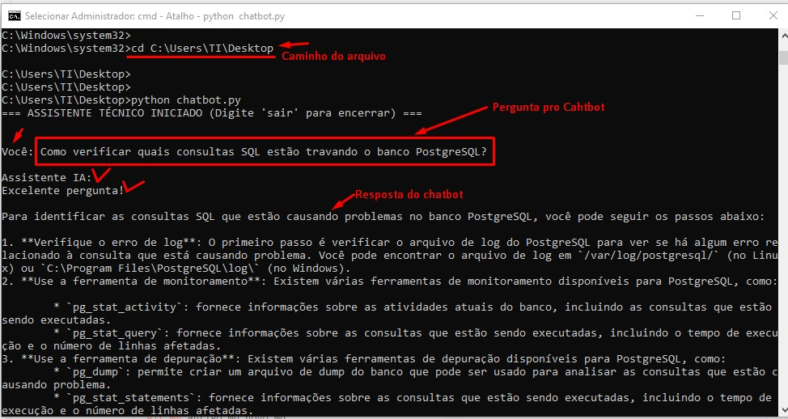
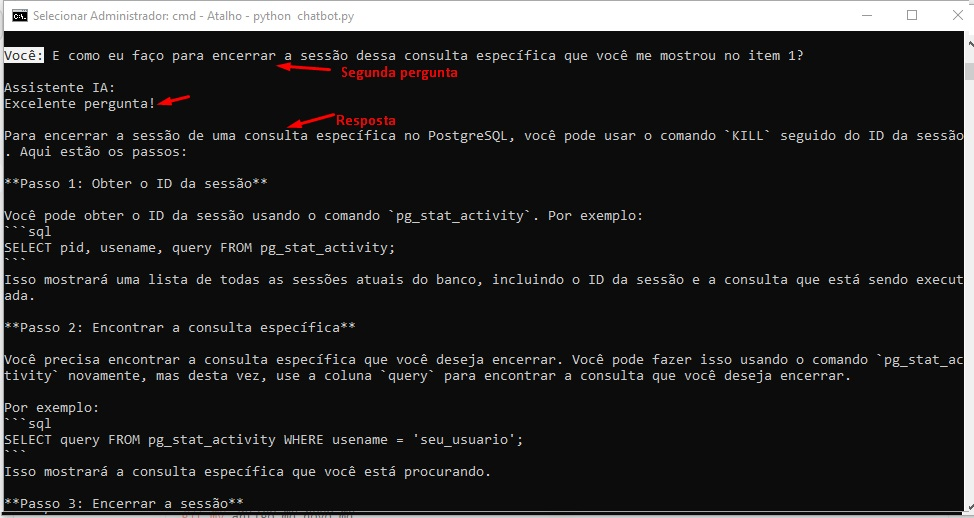
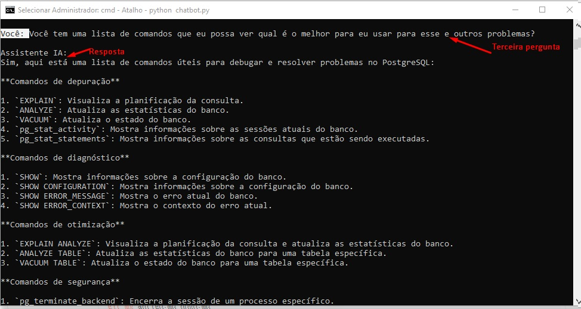

# 🤖 Chatbot Técnico com LLM Local (Llama 3.2 + Python)

Projeto desenvolvido utilizando a biblioteca oficial da OpenAI integrada ao modelo open-source **Llama 3.2** rodando localmente via **Ollama**. O objetivo é demonstrar a arquitetura e implementação prática de um chatbot para suporte técnico e diagnósticos de infraestrutura/SQL, aplicando conceitos avançados de Engenharia de Prompt.

## 🎯 Conceitos Técnicos Aplicados

- **Arquitetura Stateless & Gestão de Estado:** Implementação de gerenciamento do histórico de conversas via array de mensagens (`system`, `user`, `assistant`) para manter a memória de contexto.
- **Engenharia de Prompt:** Definição de *System Prompts* para limitação de escopo, especificação de papéis (Nível 3 de TI) e restrições de saída.
- **Parametrização de LLM:** Uso de `temperature=0.2` para respostas determinísticas e precisas, eliminando alucinações em respostas técnicas.
- **Privacidade & Custo Zero:** Execução local do modelo sem envio de dados para APIs externas e sem custos por requisição.

## 🛠️ Tecnologias Utilizadas

- **Linguagem:** Python 3.x
- **Framework/API:** `openai` Python SDK
- **Modelo de IA:** Llama 3.2 (3B) via Ollama
- **Ambiente:** Localhouse (Localhost:11434)

## 🚀 Como Executar o Projeto

### Pré-requisitos
1. Instalar o [Ollama](https://ollama.com/)
2. Baixar o modelo Llama 3.2 no terminal:
   ```bash
   ollama run llama3.2

---
## Imagens do Chatbot funcionando:

### 📸 Demonstração do Chatbot em Execução

#### 1ª Interação: Configuração e Contexto
Aqui vemos o chatbot respondendo à primeira pergunta sobre o PostgreSQL, mantendo o tom técnico e direto definido no System Prompt.


#### 2ª Interação: Teste de Memória e Contexto
O chatbot é questionado sobre como "encerrar essa sessão". Ele identifica corretamente que a sessão refere-se ao PostgreSQL mencionado anteriormente, sem que a palavra "PostgreSQL" fosse repetida.


#### 3ª Interação: Resumo Estruturado
Por fim, o chatbot lê todo o histórico e gera um resumo organizado em uma tabela Markdown, conforme instruído.


